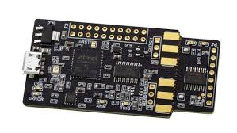
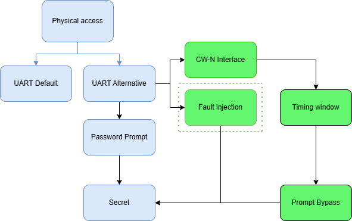
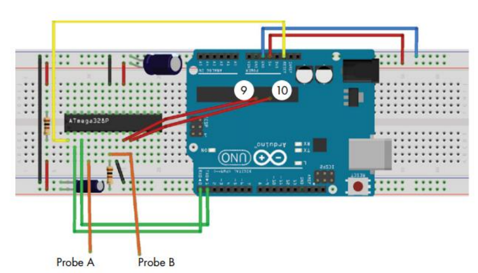

# Embedded Security Project


The goal of the project is to perform a practical attack against an Arduino Uno that contains a secret passphrase (hash and associated salt). 

## How to carry out this attack?

There are several techniques that will allow recovery of this secret passphrase. But in this case, the two main types of attacks are:

- Single power analysis (SPA):

  A side-channel attack that exploits a single power trace measured during
  the execution of an algorithm on a microcontroller.
  By observing the time-domain shape of this trace, one can identify which
  instructions or operations were executed,
  and if these operations depend on a secret (e.g. a key bit), one can
  deduce that secret.

- Fault injection:

  The set of techniques aimed at intentionally causing a malfunction in
  hardware by operating it outside normal conditions
  to try to obtain a useful behavior (e.g. bypassing a check, leaking a
  secret, corrupting a verification).
  Unlike side-channel analysis, we modify the environment to force a
  failure, not just observe it.

We will subsequently use the concept of single power analysis (SPA).

## ChipWhisperer Nano



The use of the ChipWhisperer Nano is crucial and allows observing the ATmega328P’s power consumption by capturing the current curve during password verification in order to spot patterns such as loops, memory reads or data-dependent operations.
It is also used to statistically analyze these traces: we automate the correlation between hypotheses on bytes or bits of the secret and thousands of traces to extract hidden keys or values.

## Attack tree

The diagram below shows the attack tree of our vault:



## Flash the firmware on the target

First, the firmware must be flashed onto the Arduino Uno

```avrdude -v -patmega328p -carduino -P/dev/ttyACM0 -b115200 -Uflash:w:firmware.elf```

## Schematic of the setup

The schematic represents the setup that will allow power analysis to bypass the password



100 ohm resistors and capacitors between 100 and 300 µF are used.

A few additions must be made for the setup to be complete:
- A connection between ChipWhisperer pin 2 (CW) and the breadboard ground
- A connection between CW pin 8 and the breadboard 5V supply
- A connection between CW pin 10 and ATMEGA pin 17
- A connection between CW pin 12 and ATMEGA pin 16

## Attack(s) description and implementation

### Capture execution traces

Objective: Capture power traces during execution of the password verification routine to enable SPA.

Procedure:

1. Send an input — “incorrect” case: send a random string (e.g. AAAAA…) and capture the trace.
2. Repeat for several distinct inputs to observe variability..
3. If available, obtain a “success” trace: if we know the password or have a way to force it, capture at least one trace showing the successful path.

### SPA Analysis 

Objective: Use Simple Power Analysis to locate the comparison routine, determine if it performs data-dependent operations and extract the password byte by byte.

1. Visualization: Open the captured traces on the window corresponding to the comparison (use the trigger as a landmark).
2. Identify signatures: Look for repetitive sequences — series of pulses or motifs that repeat N times (N ≈ length of the password).
- Look for differences in length or amplitude between “fail” and “success” (signature of early-exit or secret read)
3. Position brute-force exploitation: If the routine stops at the first incorrect character (early-exit), proceed position by position:
- For position 1, send different characters (0x00 → 0x7F) and measure the duration or the length of the sequence in the trace.
- The character that causes the longest execution is most likely the correct character for position 1.
- Repeat for position 2, etc., until the full string is reconstructed.

  
### Final recovery (extracting hash+salt or the password)

Objective: Use the reconstructed password (via SPA) to obtain the vault’s final output: Hash + Salt.

If SPA allowed reconstruction of the password:
- Enter the reconstructed password into the vault interface (via serial terminal).

## Vulnerability severity assessment
source: https://nvd.nist.gov/vuln-metrics/cvss/v4-calculator

CVSS v4.0 Score: 1.5 (Low)
### CVSS v4.0 Vector
```CVSS:4.0/AV:P/AC:H/AT:P/PR:N/UI:N/VC:H/VI:L/VA:N/SC:L/SI:N/SA:N/E:P/CR:H/IR:M/AR:L/MAV:P/MAC:H/MAT:P/MPR:N/MUI:N/MVC:H/MVA:L/MSC:L/MSI:L/MSA:N/S:N/AU:N/R:I```

CVSS v4.0 Score: 1.5 (Low)

### Metrics Justifications

### Base Metrics
| Metric | Value | Justification |
|--------|-------|---------------|
| Attack Vector (AV) | Physical (P) | Physical access required to connect probes / program / glitch. |
| Attack Complexity (AC) | High (H) | Skills and fine tuning required (synchronization, analysis, hardware). |
| Attack Requirements (AT) | Present (P) | Specialized hardware required (ChipWhisperer, probe, wiring). |
| Privileges Required (PR) | None (N) | No software privileges required. |
| User Interaction (UI) | None (N) | No user cooperation required. |
| Confidentiality (VC) | High (H) | Possible disclosure of the keyphrase / hash+salt. |
| Integrity (VI) | Low (L) | Exploitation aims at disclosure; firmware modification possible but not primary. |
| Availability (VA) | None (N) | Attack does not aim to disrupt service. |
| Confidentiality (SC) | Low (L) | Disclosure of the secret could facilitate secondary attacks, but scope is limited. |
| Integrity (SI) | Low (L) | Limited possibility to spoof other systems via this secret. |
| Availability (SA) | None (N) | No expected impact on third-party system availability. |

### Supplemental Metrics

| Metric | Value | Justification |
|--------|-------|---------------|
| Safety (S) | None (N) | No physical impact / risk to people. |
| Automatable (AU) | No (N) | Requires human intervention and adjustments, not automatable. |
| Recovery (R) | Irrecoverable (I) | If the keyphrase is disclosed, it must be regenerated — permanent impact. |
| Value Density (V) | High (H) | Unique secret with high value (vault access / proof of attack). |
| Vulnerability Response Effort (RE) | Moderate (M) | Fix requires firmware modification + hardware additions. |

### Environmental (Modified Base Metrics)

| Metric | Value | Justification |
|--------|-------|---------------|
| Attack Vector (MAV) | Physical (P) | Same local constraints as the base case. |
| Attack Complexity (MAC) | High (H) | Complex attack requiring calibration / skill. |
| Attack Requirements (MAT) | Present (P) | Specialized hardware still required. |
| Privileges Required (MPR) | None (N) | No software privileges required. |
| User Interaction (MUI) | None (N) | No user involvement needed to exploit. |
| Confidentiality (MVC) | High (H) | Confidentiality is critical in the environment. |
| Integrity (MVI) | Not Defined (X) | Integrity is important (firmware) but secondary. |
| Availability (MVA) | Low (L) | Availability desired but impact limited. |
| Confidentiality (MSC) | Low (L) | Secondary impacts are limited. |
| Integrity (MSI) | Low (L) | Secondary impacts are limited. |
| Availability (MSA) | Negligible (N) | No secondary impact. |

### Environmental (Security Requirements)

| Metric | Value | Justification |
|--------|-------|---------------|
| Confidentiality Requirements (CR) | High (H) | The vault’s purpose is to protect the confidentiality of the secret. |
| Integrity Requirements (IR) | Medium (M) | Integrity is important but less critical than confidentiality |
| Availability Requirements (AR) | Low (L) | Availability is not critical compared to confidentiality. |

### Threat Metrics

| Metric | Value | Justification |
|--------|-------|---------------|
| Exploit Maturity (E) | Proof-of-Concept (POC) | Exploitation demonstrable in lab with equipment and scripts, but not trivial or widely published. |


## Countermeasures

### 1. Constant-time execution (no early-exit)

Avoid making the duration or sequence of instructions dependent on tested bytes (e.g. early exit as soon as a mismatching character is found).
Thus no visible difference in the power trace or timing leaks information to the attacker.

### 2. Masking / data-independent operations

Make instantaneous power consumption independent of processed values by using random transformations (masks) that cancel the effect of the secret on consumption

### 3. Add noise (filtered supply, capacitors, EM shielding) and random delays

Increase the signal-to-noise ratio threshold required for SPA/DPA (via hardware and software techniques) to make power analysis harder.

### 4. Analysis detection (watchdog / brown-out / supply perturbation detection)

Detect abnormal conditions (voltage drops, glitches, frequent resets) and react (block, erase secret, enter secure mode) to prevent or make the attack destructive.
